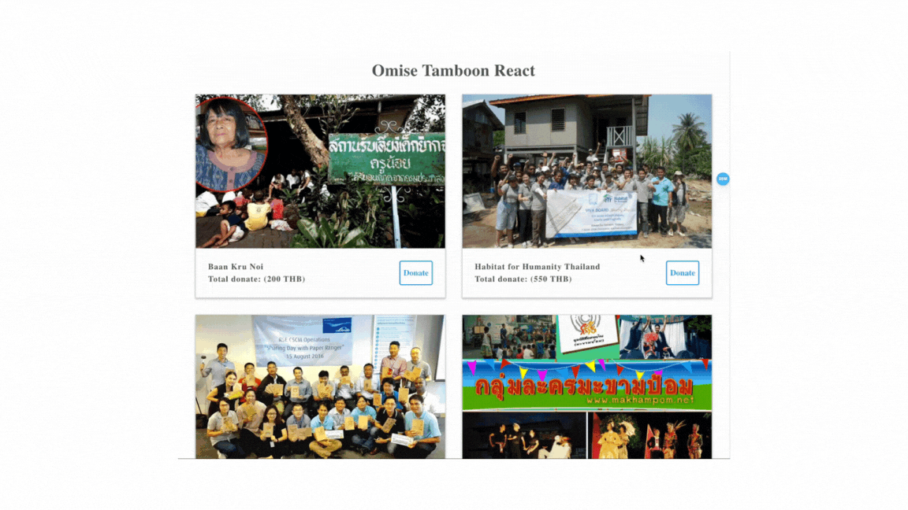
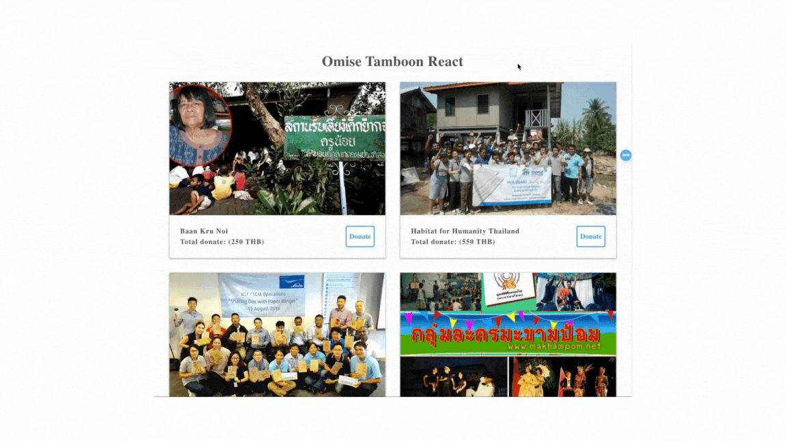

  

**Tamboon React** is a code challenge for frontend developer.

## Scenario

Once upon a time.. nope!  
So here, you have been temporarily hired by Omise and assigned to work on the charity donation project which the previously assigned front-end developer and designer got the urgent matters to solve, so they will not be able to finish the project on time..

Fortunately, the API server is already done. You will need to grab on the requirements and complete the project while ensuring the application to have great engineering and well-design ✨

## Mission

Well, grap your guns, stock up your food and bring down your armor. We gonna need it for tonight!  
**Here are the tasks you must complete:**

- [x] Complete the application according to the design (image above).
- [x] Complete these features that are not in the design (you have freedom to design and position to display).
  - Display all donation amount.
  - Display a message when paid.
- [x] Make the donation feature works correctly.
  - Amount in all donations should be displayed correctly despite users close and come back later.
  - Database (db.json) should have the new valid data when paid.
- [x] Refactor the code to be more readable and enhance reusability.
- [x] Use [styled-component](https://www.styled-components.com/), [JSS](https://cssinjs.org/) or CSS, for styling part.
- [x] Write a nice commit message and order it well.
- [x] Display well in most modern browser (Google Chrome, Safari, Firefox).

#### Bonus

- [x] Supporting different screen sizes (responsive).
- [ ] Write helpers or components unit tests with [jest](https://facebook.github.io/jest/).

## Rules

Desire to win the war? Well, to make it a little more fun, please remember that

**You cannot:**

- Change existing behaviors.
- Change the API server.
- Change from JavaScript/TypeScript to other languages.

**In the other hand, feel free to:**

- Improve the design to have better UI and UX.
- Re-organize the codebase.
- Create new modules/methods/components.
- Modify existing code.
- Add new packages.
- Update `webpack` config.
- Change language from JavaScript to TypeScript.
- Take reasonable time to complete the challenge, no need to rush.
- Edit `README.md` to add documentation. What have you done or how to run or test your app?

**Note**: You can see design inside folder `resources`.

## Surprise us!

You can push the project to your Github then share the link with us, or you can zip the project and send it back to us as well. Your commit message must communicate clearly what has been done in each commit.

If you notice more bugs in the original implementation you can add fixes for those as well. You won't be penalized if you don't. However we ask you not to add more features than the one given in the mission list.

Let's rock! :metal:

## Applicant (nutchapon) Extra Document

### Project clone

1. if using patches file

   1.1 apply all patches to master branch

   1.2 go to **How to run project** section.

2. if using my own github (in case something wrong with patches file)

   2.1 go to `https://github.com/nutchaponhan/opn-challenges-react`

   2.2 clone repo `git clone https://github.com/nutchaponhan/opn-challenges-react`

   2.3 make sure that checkout to branch `nutchapon/challenght-react`

   2.4 go to **How to run project** section.

### How to run project.

1. verify node version is 16 `node -v`

   1.1 if node version = 16 skip to step 2

   1.2 run `nvm use 16` or `nvm install 16 && nvm use 16`

2. install dependency `yarn` or `npm install`

3. start API-server `yarn server`

4. start Client `yarn client`

5. start using app

optionals

6. simulate networking (slow or fail) to see lovely message toast ❤️

   6.1 open network tab (assume using chrome)

   - for mac `Command + Option + I`
   - for window `Ctrl + Shift + I`

     6.2 set networking speed to `slow 3G` or `Offline`

   
   

### Project improvement details 😁.

- webpack

  - added proxy config to solve CORS problem
  - update version to `5.91.0` to work with .mjs file (from new library)

- redux store

  - store pattern to use reduxToolkit

- babel

  - added babel config to transform runtime to support `async await` syntax
  - added babel config support `css`

- toast

  - added react-toastify into application

- react

  - change react syntax from class to function component
  - change fetcher from isomorphic-fetch to axios
  - change react life cycle from class to hooks
